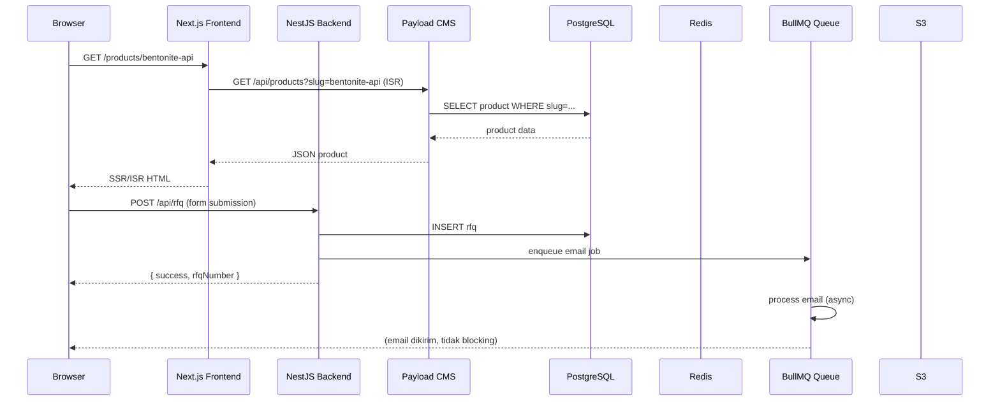

# Dokumen Desain Teknis

<!-- 
  Technical Design Document (TDD)
  PT Adto Cipta Usaha Mandiri — Enterprise Website Platform
  Dokumen: TDD-ADTO-ENT-001 | Versi: 1.0.0 | Tanggal: 2026-07-01
-->

## Overview

**Adto Enterprise Website Platform** adalah platform digital enterprise terpadu untuk PT Adto Cipta Usaha Mandiri, perusahaan B2B industrial di sektor Oil & Gas. Platform ini dirancang dengan arsitektur modern yang memisahkan Frontend, Backend API, dan CMS sebagai komponen mandiri namun terintegrasi erat.

### Tujuan Desain

Dokumen ini mendefinisikan arsitektur teknis, komponen sistem, model data, strategi penanganan error, dan sifat kebenaran (correctness properties) untuk menjamin implementasi yang konsisten dengan seluruh kebutuhan yang tertuang dalam SRS-ADTO-ENT-001.

### Prinsip Desain Utama

1. **Separation of Concerns** — Frontend (Next.js), Backend API (NestJS), dan CMS (Payload CMS) berjalan sebagai layanan terpisah dengan tanggung jawab yang jelas.
2. **Content-First Architecture** — Payload CMS sebagai sumber kebenaran konten; Next.js mengonsumsi konten via REST/GraphQL.
3. **Performance by Default** — ISR, CDN, WebP image optimization, dan connection pooling diaktifkan sejak awal.
4. **Security by Design** — RBAC, JWT dengan Redis, rate limiting, file validation, dan HTTPS wajib di semua lapisan.
5. **Async-First Notifications** — Semua operasi notifikasi berjalan melalui BullMQ Queue agar tidak memblokir respons API.
6. **Future-Ready Architecture** — Modul dirancang agar ekspansi Customer Portal, Vendor Portal, dan CRM Integration (v2.0) dapat ditambahkan tanpa rekayasa ulang mendasar.


---

## Architecture

### Gambaran Arsitektur Tingkat Tinggi

Platform ini menggunakan pola **Multi-Service Architecture** dengan tiga layanan utama yang berkomunikasi melalui HTTP/REST internal:

```
┌─────────────────────────────────────────────────────────────────────┐
│                          INTERNET / CDN                              │
└───────────────────────────────┬─────────────────────────────────────┘
                                │ HTTPS
                    ┌───────────▼───────────┐
                    │   Nginx / Traefik     │  ← Reverse Proxy / SSL
                    │   (Load Balancer)     │
                    └──┬────────┬───────────┘
                       │        │
          ┌────────────▼──┐  ┌──▼──────────────────┐
          │  Next.js 14   │  │   NestJS Backend     │
          │  (Frontend)   │  │   (API + Business    │
          │  Port: 3000   │  │    Logic)            │
          └───────┬───────┘  │   Port: 3001         │
                  │           └──┬──────────────────┘
                  │              │
          ┌───────▼───────┐  ┌──▼──────────────────┐
          │ Payload CMS   │  │   PostgreSQL 15      │
          │ (Content API) │  │   + PgBouncer        │
          │ Port: 3002    │  │   Port: 5432         │
          └───────────────┘  └─────────────────────┘
                                │
                    ┌───────────▼──────────────────┐
                    │   Redis 7 (Cache + Session   │
                    │   + BullMQ Queue)            │
                    │   Port: 6379                 │
                    └──────────────────────────────┘
                                │
                    ┌───────────▼──────────────────┐
                    │   S3 Compatible Storage      │
                    │   (Cloudflare R2 / MinIO)    │
                    └──────────────────────────────┘
```


### Pola Komunikasi Antar Layanan



### Strategi Rendering Next.js

| Jenis Halaman | Strategi | Revalidasi |
|---|---|---|
| Homepage | ISR | 60 detik |
| Halaman Produk (list & detail) | ISR + generateStaticParams | 60 detik |
| Halaman Artikel / Blog | ISR + generateStaticParams | 60 detik |
| Halaman Layanan & Industri | ISR | 60 detik |
| Halaman Proyek & Portofolio | ISR | 60 detik |
| Halaman Kontak, RFQ, Karir | SSR (dynamic, form-driven) | — |
| Dashboard CMS (Payload) | SPA (Payload built-in) | — |
| Halaman Search | SSR (query-dependent) | — |


---

## Components and Interfaces

### 3.1 Struktur Direktori Frontend (Next.js)

```
apps/web/
├── app/
│   ├── (public)/                  # Layout publik
│   │   ├── layout.tsx
│   │   ├── page.tsx               # Homepage
│   │   ├── about/page.tsx
│   │   ├── services/
│   │   │   ├── page.tsx           # Daftar layanan
│   │   │   └── [slug]/page.tsx    # Detail layanan
│   │   ├── products/
│   │   │   ├── page.tsx
│   │   │   └── [slug]/page.tsx
│   │   ├── industries/
│   │   │   └── [slug]/page.tsx
│   │   ├── projects/
│   │   │   └── [slug]/page.tsx
│   │   ├── blog/
│   │   │   ├── page.tsx
│   │   │   └── [slug]/page.tsx
│   │   ├── news/
│   │   │   └── [slug]/page.tsx
│   │   ├── media/page.tsx
│   │   ├── downloads/page.tsx
│   │   ├── careers/
│   │   │   ├── page.tsx
│   │   │   └── [slug]/page.tsx
│   │   ├── vendors/register/page.tsx
│   │   ├── rfq/page.tsx
│   │   ├── contact/page.tsx
│   │   ├── search/page.tsx
│   │   └── faq/page.tsx
│   ├── sitemap.ts                 # Dynamic sitemap
│   ├── robots.ts                  # Robots.txt
│   └── api/
│       └── revalidate/route.ts    # Webhook revalidasi ISR
├── components/
│   ├── ui/                        # Komponen UI dasar
│   ├── sections/                  # Section-level components
│   ├── forms/                     # Form components
│   └── seo/                       # SEO components
├── lib/
│   ├── payload.ts                 # Payload CMS client
│   ├── api.ts                     # NestJS API client
│   └── utils.ts
└── types/                         # TypeScript type definitions
```


### 3.2 Struktur Direktori Backend (NestJS)

```
apps/api/
├── src/
│   ├── main.ts
│   ├── app.module.ts
│   ├── modules/
│   │   ├── auth/                  # JWT, RBAC, session Redis
│   │   │   ├── auth.module.ts
│   │   │   ├── auth.controller.ts
│   │   │   ├── auth.service.ts
│   │   │   ├── guards/
│   │   │   └── strategies/
│   │   ├── rfq/                   # RFQ Platform
│   │   │   ├── rfq.module.ts
│   │   │   ├── rfq.controller.ts
│   │   │   ├── rfq.service.ts
│   │   │   └── dto/
│   │   ├── career/                # Career Portal
│   │   ├── vendor/                # Vendor Registration
│   │   ├── contact/               # Contact Form
│   │   ├── search/                # Search Platform
│   │   ├── media/                 # Media & Download tracking
│   │   ├── notification/          # Email service
│   │   ├── queue/                 # BullMQ processors
│   │   ├── health/                # Health check endpoint
│   │   └── analytics/             # Analytics events
│   ├── common/
│   │   ├── filters/               # Global exception filter
│   │   ├── interceptors/          # Logging, transform
│   │   ├── guards/                # Rate limiting, auth
│   │   ├── decorators/
│   │   └── pipes/                 # Validation pipes
│   ├── config/                    # Config modules
│   └── prisma/                    # Prisma service
├── prisma/
│   ├── schema.prisma
│   └── migrations/
└── test/
```

### 3.3 Antarmuka API Utama (NestJS)

| Endpoint | Metode | Akses | Deskripsi |
|---|---|---|---|
| `/api/auth/login` | POST | Publik | Login pengguna internal |
| `/api/auth/logout` | POST | Authenticated | Logout, invalidasi refresh token |
| `/api/auth/refresh` | POST | Publik | Refresh access token |
| `/api/auth/reset-password` | POST | Publik | Kirim link reset password |
| `/api/rfq` | POST | Publik | Submit form RFQ |
| `/api/rfq` | GET | Sales, Admin | Daftar semua RFQ |
| `/api/rfq/:id/status` | PATCH | Sales, Admin | Update status RFQ |
| `/api/careers/apply` | POST | Publik | Submit lamaran kerja |
| `/api/vendors/register` | POST | Publik | Submit registrasi vendor |
| `/api/vendors/:id/verify` | PATCH | Procurement, Admin | Update status verifikasi vendor |
| `/api/contact` | POST | Publik | Submit form kontak |
| `/api/search` | GET | Publik | Global search query |
| `/api/media/download/:id` | POST | Publik | Tracking unduhan dokumen |
| `/api/health` | GET | Publik | Status kesehatan sistem |


### 3.4 Komponen Payload CMS

Payload CMS meng-expose REST API dan Admin UI. Collection yang didefinisikan:

| Collection | Slug | Deskripsi |
|---|---|---|
| Users | `users` | Pengguna internal CMS dengan RBAC |
| Products | `products` | Katalog produk |
| Services | `services` | Halaman layanan |
| Industries | `industries` | Industri yang dilayani |
| Projects | `projects` | Portofolio proyek |
| Articles | `articles` | Blog & Knowledge Center |
| News | `news` | Berita & siaran pers |
| Jobs | `jobs` | Lowongan kerja |
| FAQs | `faqs` | Pertanyaan & jawaban |
| Media | `media` | Aset gambar & dokumen |
| Downloads | `downloads` | Dokumen unduhan |
| Testimonials | `testimonials` | Testimoni klien |
| CompanyStats | `company-stats` | Statistik perusahaan (global) |
| Settings | `site-settings` | Konfigurasi global (SEO default, WhatsApp, kontak) |

**Globals** (singleton documents):

| Global | Slug | Deskripsi |
|---|---|---|
| Homepage | `homepage` | Konfigurasi homepage (hero, statistik) |
| AboutPage | `about-page` | Company profile, timeline, struktur organisasi |
| SEODefaults | `seo-defaults` | Default meta title/description template |

### 3.5 Komponen Notifikasi & Queue

BullMQ Queue berjalan dalam proses NestJS yang sama (worker thread terpisah). Queue yang didefinisikan:

| Queue Name | Job Types | Retry Policy |
|---|---|---|
| `notification` | `send-email` | 3x retry: 1 menit, 5 menit, 15 menit |
| `media-processing` | `optimize-image`, `generate-thumbnail` | 2x retry: 30 detik |
| `search-index` | `update-index` | 1x retry: 1 menit |


---

## Data Models

### 4.1 Skema Database PostgreSQL (Prisma Schema)

#### Entitas Pengguna & Autentikasi

```prisma
model User {
  id            String    @id @default(uuid()) @db.Uuid
  email         String    @unique
  passwordHash  String
  role          Role
  isActive      Boolean   @default(true)
  createdAt     DateTime  @default(now())
  updatedAt     DateTime  @updatedAt
  
  auditLogs     AuditLog[]
  
  @@index([email])
}

enum Role {
  SUPER_ADMIN
  ADMINISTRATOR
  MARKETING
  SALES
  HR
  CONTENT_EDITOR
  PROCUREMENT
  MANAGEMENT
}

model RefreshToken {
  id        String   @id @default(uuid()) @db.Uuid
  userId    String   @db.Uuid
  tokenHash String   @unique
  expiresAt DateTime
  createdAt DateTime @default(now())
  
  @@index([userId])
}

model AuditLog {
  id         String   @id @default(uuid()) @db.Uuid
  userId     String   @db.Uuid
  action     String
  resource   String
  resourceId String?
  metadata   Json?
  createdAt  DateTime @default(now())
  
  user       User     @relation(fields: [userId], references: [id])
  
  @@index([userId])
  @@index([createdAt])
}
```


#### Entitas RFQ Platform

```prisma
model RFQ {
  id                String      @id @default(uuid()) @db.Uuid
  referenceNumber   String      @unique
  companyName       String
  picName           String
  picTitle          String
  email             String
  phone             String
  productService    String
  specifications    String      @db.Text
  estimatedQuantity String?
  deliveryLocation  String?
  deadline          DateTime?
  attachmentUrl     String?
  status            RFQStatus   @default(NEW)
  notes             String?     @db.Text
  createdAt         DateTime    @default(now())
  updatedAt         DateTime    @updatedAt
  
  @@index([status])
  @@index([createdAt])
}

enum RFQStatus {
  NEW
  REVIEWED
  IN_PROGRESS
  COMPLETED
  REJECTED
}
```

#### Entitas Career Portal

```prisma
model JobPosting {
  id           String        @id @default(uuid()) @db.Uuid
  slug         String        @unique
  title        String
  department   String
  location     String
  contractType String
  description  String        @db.Text
  requirements String        @db.Text
  closingDate  DateTime
  isActive     Boolean       @default(true)
  createdAt    DateTime      @default(now())
  updatedAt    DateTime      @updatedAt
  
  applications JobApplication[]
  
  @@index([isActive])
  @@index([closingDate])
}

model JobApplication {
  id           String           @id @default(uuid()) @db.Uuid
  jobPostingId String           @db.Uuid
  fullName     String
  email        String
  phone        String
  cvUrl        String
  message      String?          @db.Text
  status       ApplicationStatus @default(RECEIVED)
  createdAt    DateTime         @default(now())
  
  jobPosting   JobPosting @relation(fields: [jobPostingId], references: [id])
  
  @@index([jobPostingId])
  @@index([createdAt])
}

enum ApplicationStatus {
  RECEIVED
  REVIEWED
  SHORTLISTED
  REJECTED
}
```


#### Entitas Vendor Registration

```prisma
model VendorRegistration {
  id              String         @id @default(uuid()) @db.Uuid
  referenceNumber String         @unique
  companyName     String
  npwp            String         @unique
  nib             String
  address         String         @db.Text
  picName         String
  picEmail        String
  picPhone        String
  productCategory String[]
  documents       Json           // Array of { name, url, type }
  status          VendorStatus   @default(PENDING)
  rejectionReason String?        @db.Text
  reviewedAt      DateTime?
  createdAt       DateTime       @default(now())
  updatedAt       DateTime       @updatedAt
  
  @@index([npwp])
  @@index([status])
  @@index([createdAt])
}

enum VendorStatus {
  PENDING
  IN_REVIEW
  APPROVED
  REJECTED
}
```

#### Entitas Notifikasi Log

```prisma
model NotificationLog {
  id          String             @id @default(uuid()) @db.Uuid
  type        String             // rfq_new, application_new, vendor_new, contact_new
  recipient   String
  subject     String
  status      NotificationStatus @default(PENDING)
  attempts    Int                @default(0)
  lastError   String?
  sentAt      DateTime?
  createdAt   DateTime           @default(now())
  
  @@index([status])
  @@index([createdAt])
}

enum NotificationStatus {
  PENDING
  SENT
  FAILED
}
```

#### Entitas Download Tracking

```prisma
model DownloadLog {
  id          String   @id @default(uuid()) @db.Uuid
  documentId  String
  documentName String
  ipHash      String   // IP address di-hash untuk anonimitas
  userAgent   String?
  gatedData   Json?    // { name, email, company } untuk unduhan terproteksi
  createdAt   DateTime @default(now())
  
  @@index([documentId])
  @@index([createdAt])
}

model ContactMessage {
  id        String   @id @default(uuid()) @db.Uuid
  fullName  String
  email     String
  phone     String?
  subject   String
  message   String   @db.Text
  createdAt DateTime @default(now())
  
  @@index([createdAt])
}
```


### 4.2 Payload CMS Collection Schema (TypeScript)

```typescript
// products collection
export const Products: CollectionConfig = {
  slug: 'products',
  admin: { useAsTitle: 'name' },
  fields: [
    { name: 'name', type: 'text', required: true },
    { name: 'slug', type: 'text', unique: true, required: true },
    { name: 'category', type: 'select', options: ['chemical', 'sparepart', 'mobilization'] },
    { name: 'industry', type: 'relationship', relationTo: 'industries', hasMany: true },
    { name: 'shortDescription', type: 'textarea' },
    { name: 'description', type: 'richText' },
    { name: 'specifications', type: 'array', fields: [
      { name: 'label', type: 'text' },
      { name: 'value', type: 'text' },
    ]},
    { name: 'images', type: 'array', fields: [
      { name: 'image', type: 'upload', relationTo: 'media' },
    ]},
    { name: 'datasheet', type: 'upload', relationTo: 'media' },
    { name: 'relatedProducts', type: 'relationship', relationTo: 'products', hasMany: true },
    { name: 'seo', type: 'group', fields: [
      { name: 'metaTitle', type: 'text', maxLength: 60 },
      { name: 'metaDescription', type: 'textarea', maxLength: 160 },
      { name: 'ogImage', type: 'upload', relationTo: 'media' },
    ]},
    { name: '_status', type: 'select', options: ['draft', 'published'] },
  ],
};
```

### 4.3 Format Nomor Referensi

| Entitas | Format | Contoh |
|---|---|---|
| RFQ | `RFQ-{YYYY}-{NNNNN}` | `RFQ-2026-00001` |
| Vendor | `VND-{YYYY}-{NNNNN}` | `VND-2026-00001` |

Counter direset setiap tahun dan disimpan di tabel `SequenceCounter`:

```prisma
model SequenceCounter {
  id       String  @id
  year     Int
  sequence Int     @default(0)
  
  @@unique([id, year])
}
```


---

## Correctness Properties

*A property is a characteristic or behavior that should hold true across all valid executions of a system — essentially, a formal statement about what the system should do. Properties serve as the bridge between human-readable specifications and machine-verifiable correctness guarantees.*

Bagian ini mendefinisikan sifat kebenaran yang dapat diuji secara otomatis menggunakan property-based testing untuk memverifikasi logika bisnis inti platform.

### Property 1: Validasi Form Menghasilkan Error untuk Setiap Field Tidak Valid

*Untuk sembarang* kombinasi pengiriman form (RFQ, Lamaran Kerja, Registrasi Vendor, Kontak) di mana satu atau lebih field wajib dikosongkan atau diisi dengan data tidak valid, sistem harus mengembalikan pesan error yang spesifik untuk setiap field yang tidak valid, dan tidak ada field tidak valid yang lolos validasi tanpa pesan error.

**Validates: Requirements AC-FR-010-4, AC-FR-012-3, AC-FR-013-2**

---

### Property 2: Pencarian Selalu Inklusif untuk Kata Kunci yang Relevan

*Untuk sembarang* kata kunci `q` yang diketahui terkandung dalam nama, deskripsi, atau konten setidaknya satu item (produk, artikel, proyek, atau berita), fungsi pencarian harus mengembalikan setidaknya satu hasil yang mengandung `q` dalam judul atau deskripsinya.

**Validates: Requirements AC-FR-004-2, AC-FR-014-1**

---

### Property 3: Thumbnail Gambar Selalu ≤ 100KB dan Berformat WebP

*Untuk sembarang* gambar valid yang diunggah (JPEG, PNG, atau WebP) dengan ukuran berapa pun hingga 10MB, thumbnail yang dihasilkan oleh Media_Manager harus selalu berukuran tidak lebih dari 100KB dan berada dalam format WebP.

**Validates: Requirements AC-FR-009-7**

---

### Property 4: Waktu Baca Bersifat Monoton terhadap Panjang Teks

*Untuk sembarang* dua konten artikel A dan B, jika jumlah kata artikel A lebih banyak dari artikel B, maka estimasi waktu baca artikel A harus selalu lebih besar atau sama dengan estimasi waktu baca artikel B.

**Validates: Requirements AC-FR-007-5**

---

### Property 5: Keunikan Nomor Referensi RFQ

*Untuk sembarang* sejumlah N pengajuan RFQ yang dibuat (N ≥ 1), semua nomor referensi yang dihasilkan harus unik satu sama lain dan masing-masing harus mengikuti format `RFQ-{YYYY}-{NNNNN}` di mana YYYY adalah tahun saat ini dan NNNNN adalah nomor urut 5 digit yang dimulai dari `00001`.

**Validates: Requirements AC-FR-012-7**

---

### Property 6: NPWP Duplikat Selalu Ditolak

*Untuk sembarang* nomor NPWP yang sudah terdaftar dalam sistem dengan status aktif, setiap upaya registrasi vendor baru dengan NPWP yang sama harus selalu ditolak dengan pesan "NPWP sudah terdaftar", tanpa memperhatikan data lain dalam form registrasi.

**Validates: Requirements AC-FR-011-2**

---

### Property 7: RBAC Selalu Mencegah Akses Tidak Sah

*Untuk sembarang* kombinasi (pengguna dengan peran R, endpoint E) di mana peran R tidak memiliki izin untuk mengakses endpoint E, setiap request ke endpoint tersebut harus selalu menghasilkan respons HTTP 403 Forbidden, terlepas dari data payload atau parameter request.

**Validates: Requirements AC-FR-016-6**

---

### Property 8: Login Valid Menghasilkan Token yang Dapat Diverifikasi

*Untuk sembarang* pasangan (email, password) yang terdaftar dan aktif di sistem, proses login harus menghasilkan JWT access token yang dapat diverifikasi ulang dengan kunci yang sama (token tidak korup, tidak kadaluwarsa segera, dan mengandung claim userId dan role yang benar).

**Validates: Requirements AC-FR-016-1**

---

### Property 9: Rate Limiting Login Berlaku setelah 5 Percobaan Gagal

*Untuk sembarang* alamat IP, setelah tepat 5 percobaan login gagal dalam periode 15 menit, setiap percobaan login selanjutnya dari IP yang sama (baik dengan kredensial valid maupun tidak) dalam periode yang sama harus menghasilkan respons HTTP 429 Too Many Requests.

**Validates: Requirements AC-FR-016-3**

---

### Property 10: Meta Title dan Meta Description Selalu dalam Batas Karakter

*Untuk sembarang* halaman konten yang dipublikasikan dengan panjang judul dan deskripsi berapa pun, meta title yang dihasilkan oleh SEO_Platform harus selalu ≤ 60 karakter dan meta description harus selalu ≤ 160 karakter (dipotong atau dihasilkan dari konten yang ada).

**Validates: Requirements AC-FR-018-1**

---

### Property 11: Semua Halaman Terpublikasi Ada di Sitemap

*Untuk sembarang* halaman konten (produk, artikel, berita, layanan, proyek) yang berada dalam status "Terpublikasi", URL halaman tersebut harus selalu terdapat dalam sitemap.xml yang dihasilkan, dan tidak ada URL halaman yang tidak terpublikasi yang muncul dalam sitemap.

**Validates: Requirements AC-FR-018-3**

---

### Property 12: Retry Notifikasi Tidak Melebihi 3 Kali

*Untuk sembarang* job notifikasi email yang gagal pada percobaan pertama, sistem Queue harus melakukan percobaan ulang maksimal 3 kali (tidak lebih, tidak kurang jika masih gagal), dan setiap percobaan ulang mengikuti interval yang dikonfigurasi (1 menit, 5 menit, 15 menit).

**Validates: Requirements AC-FR-019-4**

---

### Property 13: Dokumen Terproteksi Tidak Dapat Diakses Tanpa Data Gated

*Untuk sembarang* dokumen yang ditandai sebagai "terproteksi" dalam sistem, setiap request unduhan yang tidak menyertakan data gated yang lengkap dan valid (nama, email, nama perusahaan) harus selalu ditolak dan tidak memulai transfer file.

**Validates: Requirements AC-FR-009-5**


---

## Error Handling

### 5.1 Format Respons Error Global

Semua error dari NestJS Backend menggunakan format yang konsisten melalui `GlobalExceptionFilter`:

```typescript
// Format standar respons error
{
  "statusCode": 422,
  "message": "Validasi gagal",
  "errors": [
    { "field": "email", "message": "Format email tidak valid" },
    { "field": "phone", "message": "Nomor telepon wajib diisi" }
  ],
  "timestamp": "2026-07-01T10:00:00.000Z",
  "requestId": "req_abc123"
}
```

### 5.2 Matriks Kode Status HTTP

| Kode | Kondisi | Contoh |
|---|---|---|
| 200 | Sukses | GET produk, GET artikel |
| 201 | Resource dibuat | POST RFQ, POST lamaran |
| 400 | Validasi gagal | Field wajib kosong |
| 401 | Tidak terautentikasi | Token tidak ada atau tidak valid |
| 403 | Tidak terotorisasi | Peran tidak memiliki izin |
| 404 | Resource tidak ditemukan | Slug produk tidak ada |
| 409 | Konflik | NPWP sudah terdaftar |
| 422 | Entity tidak valid | NPWP format salah |
| 429 | Terlalu banyak request | Rate limit atau login block |
| 500 | Server error internal | Unhandled exception |
| 503 | Service unavailable | Database tidak dapat dijangkau |

### 5.3 Penanganan Error per Modul

#### RFQ Platform
- Jika pengiriman email gagal: RFQ tetap tersimpan di database; job dimasukkan ke dead letter queue; error dicatat di `NotificationLog`; alert muncul di dashboard admin.
- Jika database tidak tersedia: Mengembalikan 503 dengan pesan "Layanan sementara tidak tersedia. Silakan coba beberapa saat lagi."

#### File Upload
- File melebihi batas ukuran: Mengembalikan 400 dengan pesan spesifik.
- MIME type tidak valid (magic bytes tidak cocok): Mengembalikan 422 dengan pesan "Tipe file tidak didukung."
- S3 tidak tersedia: Mengembalikan 503; file tidak disimpan; log error dibuat.

#### Autentikasi
- Login gagal (kredensial salah): Selalu mengembalikan 401 dengan pesan generik (tidak mengindikasikan field mana yang salah).
- Token kadaluwarsa: Frontend melakukan refresh otomatis; jika refresh token juga kadaluwarsa, redirect ke halaman login.
- IP diblokir: Mengembalikan 429 dengan header `Retry-After` yang menunjukkan waktu sisa blokir.

### 5.4 Graceful Degradation

| Dependensi | Kegagalan | Perilaku |
|---|---|---|
| Redis | Redis tidak tersedia | Backend berjalan tanpa cache; sesi menggunakan mode terbatas; rate limiting dinonaktifkan sementara |
| BullMQ Queue | Queue tidak tersedia | Notifikasi email dilakukan secara sinkron sebagai fallback |
| S3 Storage | S3 tidak tersedia | Upload ditolak dengan 503; halaman yang sudah ada tetap berfungsi dari cache CDN |
| Payload CMS | CMS tidak tersedia | Halaman publik melayani konten dari cache ISR Next.js (stale-while-revalidate) |
| Email SMTP | SMTP gagal | Job masuk ke retry queue; tidak ada degradasi tampilan untuk pengguna |


---

## Testing Strategy

### 6.1 Pendekatan Pengujian Ganda

Platform ini menggunakan pendekatan pengujian berlapis yang komplementer:

| Lapisan | Cakupan | Tools |
|---|---|---|
| **Unit Test** | Logika bisnis terisolasi, transformasi data, utilitas | Jest |
| **Property-Based Test** | Invariant universal, logika validasi, pembangkitan data | fast-check (TypeScript) |
| **Integration Test** | Interaksi API end-to-end, alur notifikasi, RBAC | Jest + Supertest |
| **E2E Test** | Alur pengguna kritikal (RFQ, lamaran, vendor) | Playwright |
| **Performance Test** | LCP, Core Web Vitals, beban concurrent | Lighthouse CI, k6 |
| **Security Scan** | OWASP Top 10, dependency vulnerabilities | OWASP ZAP, npm audit |
| **Accessibility Test** | WCAG 2.1 Level AA | Axe-core, Lighthouse |

### 6.2 Property-Based Testing dengan fast-check

Library: **fast-check** (`npm install --save-dev fast-check`)

Konfigurasi minimum 100 iterasi per property test:

```typescript
import fc from 'fast-check';

// Konfigurasi global
fc.configureGlobal({ numRuns: 100 });
```

**Tag format untuk setiap property test:**
```
Feature: adto-enterprise-website, Property {number}: {property_text}
```


### 6.3 Implementasi Property Test

#### Property 1: Validasi Form Menghasilkan Error untuk Setiap Field Tidak Valid

```typescript
// Feature: adto-enterprise-website, Property 1: Form validation generates errors for all invalid fields
describe('Form Validation Properties', () => {
  it('RFQ form: setiap field wajib yang dikosongkan menghasilkan error spesifik', () => {
    const requiredFields = ['companyName', 'picName', 'email', 'phone', 'productService', 'specifications'];
    
    fc.assert(fc.property(
      fc.subarray(requiredFields, { minLength: 1 }),
      (missingFields) => {
        const formData = buildValidRfqForm();
        missingFields.forEach(f => delete formData[f]);
        
        const result = validateRfqForm(formData);
        
        expect(result.isValid).toBe(false);
        missingFields.forEach(field => {
          expect(result.errors).toHaveProperty(field);
        });
      }
    ));
  });
});
```

#### Property 2: Pencarian Selalu Inklusif

```typescript
// Feature: adto-enterprise-website, Property 2: Search is always inclusive for relevant keywords
describe('Search Properties', () => {
  it('kata kunci yang ada di konten selalu menghasilkan setidaknya satu hasil', () => {
    fc.assert(fc.property(
      fc.record({
        items: fc.array(fc.record({
          id: fc.uuid(),
          name: fc.string({ minLength: 3 }),
          description: fc.string({ minLength: 10 }),
        }), { minLength: 1 }),
      }),
      ({ items }) => {
        const searchService = new SearchService(items);
        const randomItem = items[Math.floor(Math.random() * items.length)];
        // Ambil kata pertama dari nama item sebagai query
        const keyword = randomItem.name.split(' ')[0];
        
        const results = searchService.search(keyword);
        
        expect(results.length).toBeGreaterThanOrEqual(1);
        results.forEach(r => {
          const matchesName = r.name.toLowerCase().includes(keyword.toLowerCase());
          const matchesDesc = r.description.toLowerCase().includes(keyword.toLowerCase());
          expect(matchesName || matchesDesc).toBe(true);
        });
      }
    ));
  });
});
```

#### Property 3: Thumbnail Gambar ≤ 100KB

```typescript
// Feature: adto-enterprise-website, Property 3: Generated thumbnails are always ≤ 100KB and WebP
describe('Image Processing Properties', () => {
  it('thumbnail yang dihasilkan selalu <= 100KB dan berformat WebP', async () => {
    await fc.assert(fc.asyncProperty(
      fc.integer({ min: 100, max: 1000 }).chain(w =>
        fc.integer({ min: 100, max: 1000 }).map(h => ({ width: w, height: h }))
      ),
      async ({ width, height }) => {
        const testImage = await generateTestImage(width, height); // JPEG test image
        const result = await mediaProcessor.generateThumbnail(testImage);
        
        expect(result.buffer.byteLength).toBeLessThanOrEqual(100 * 1024); // 100KB
        expect(result.format).toBe('webp');
      }
    ));
  });
});
```

#### Property 5: Keunikan Nomor Referensi RFQ

```typescript
// Feature: adto-enterprise-website, Property 5: RFQ reference numbers are always unique and well-formatted
describe('RFQ Reference Number Properties', () => {
  it('sejumlah N RFQ yang dibuat memiliki nomor referensi yang semuanya unik', async () => {
    await fc.assert(fc.asyncProperty(
      fc.integer({ min: 1, max: 50 }),
      async (n) => {
        const rfqService = new RfqService(mockDb);
        const references = await Promise.all(
          Array.from({ length: n }, () => rfqService.generateReferenceNumber())
        );
        
        const unique = new Set(references);
        expect(unique.size).toBe(n);
        
        const year = new Date().getFullYear();
        references.forEach(ref => {
          expect(ref).toMatch(new RegExp(`^RFQ-${year}-\\d{5}$`));
        });
      }
    ));
  });
});
```


#### Property 7: RBAC Selalu Mencegah Akses Tidak Sah

```typescript
// Feature: adto-enterprise-website, Property 7: RBAC always denies unauthorized access
describe('RBAC Properties', () => {
  it('pengguna dengan peran yang tidak memiliki izin selalu mendapatkan 403', async () => {
    const protectedEndpoints: Array<{ path: string; method: string; allowedRoles: Role[] }> = [
      { path: '/api/rfq', method: 'GET', allowedRoles: [Role.SALES, Role.ADMINISTRATOR, Role.SUPER_ADMIN] },
      { path: '/api/vendors/:id/verify', method: 'PATCH', allowedRoles: [Role.PROCUREMENT, Role.ADMINISTRATOR, Role.SUPER_ADMIN] },
      // ... semua endpoint terlindungi
    ];
    
    await fc.assert(fc.asyncProperty(
      fc.constantFrom(...protectedEndpoints),
      fc.constantFrom(...Object.values(Role)),
      async (endpoint, role) => {
        if (endpoint.allowedRoles.includes(role)) return; // skip authorized cases
        
        const user = createTestUser({ role });
        const response = await request(app)
          .get(endpoint.path)
          .set('Authorization', `Bearer ${signToken(user)}`);
        
        expect(response.status).toBe(403);
      }
    ));
  });
});
```

#### Property 10: Meta Tag Selalu dalam Batas Karakter

```typescript
// Feature: adto-enterprise-website, Property 10: Meta title <= 60 chars, meta description <= 160 chars
describe('SEO Meta Tag Properties', () => {
  it('meta title dan meta description selalu dalam batas karakter', () => {
    fc.assert(fc.property(
      fc.record({
        title: fc.string({ minLength: 1, maxLength: 500 }),
        description: fc.string({ minLength: 1, maxLength: 1000 }),
      }),
      ({ title, description }) => {
        const seoService = new SeoService();
        const meta = seoService.generateMeta({ title, description });
        
        expect(meta.metaTitle.length).toBeLessThanOrEqual(60);
        expect(meta.metaDescription.length).toBeLessThanOrEqual(160);
      }
    ));
  });
});
```

### 6.4 Cakupan Test Unit (Target ≥ 70% Backend)

Modul yang diprioritaskan untuk unit test:

| Modul | Cakupan Target | Fokus |
|---|---|---|
| `auth` | ≥ 80% | JWT generation, bcrypt hashing, rate limiting logic |
| `rfq` | ≥ 80% | Validasi DTO, pembangkitan nomor referensi, perubahan status |
| `vendor` | ≥ 75% | Validasi NPWP unik, alur verifikasi status |
| `career` | ≥ 75% | Validasi form lamaran, manajemen status lowongan |
| `media` | ≥ 70% | Validasi MIME type, logic thumbnail generation |
| `seo` | ≥ 75% | Meta tag generation, schema markup, sitemap |
| `notification` | ≥ 70% | Email templating, retry logic |
| `search` | ≥ 70% | Relevance filtering, multi-category aggregation |

### 6.5 Test Integrasi Prioritas

1. **Alur RFQ End-to-End**: Submit RFQ → Simpan ke DB → Queue email → Konfirmasi terkirim
2. **Alur Autentikasi**: Login → Refresh token → Akses protected route → Logout
3. **Alur Vendor Registration**: Submit form → Validasi NPWP → Kirim notifikasi → Update status verifikasi
4. **Alur Upload Media**: Upload gambar → Validasi MIME → Optimasi Sharp → Simpan ke S3
5. **ISR Revalidation**: Update konten di Payload CMS → Webhook → Next.js revalidate

### 6.6 Test E2E dengan Playwright

Scenario E2E kritikal yang harus lulus sebelum release:

| ID | Scenario | Langkah |
|---|---|---|
| E2E-001 | Pengajuan RFQ berhasil | Buka halaman RFQ → Isi semua field → Submit → Verifikasi halaman sukses dan email diterima |
| E2E-002 | Lamaran kerja berhasil | Buka lowongan → Klik Lamar → Upload CV → Submit → Verifikasi konfirmasi |
| E2E-003 | Registrasi vendor berhasil | Buka form vendor → Isi semua field → Upload dokumen → Submit → Verifikasi email konfirmasi |
| E2E-004 | Login dan kelola RFQ | Login sebagai Sales → Buka dashboard RFQ → Update status → Verifikasi perubahan |
| E2E-005 | Publish artikel dari CMS | Login sebagai Content_Editor → Buat artikel → Preview → Publish → Verifikasi tampil di frontend |


---

## Keputusan Desain Penting

### 7.1 Mengapa Payload CMS sebagai Headless CMS?

**Keputusan:** Menggunakan Payload CMS v2 bukan Strapi atau Sanity.

**Rasionalisasi:**
- Payload CMS berjalan dalam ekosistem TypeScript/Node.js yang sama dengan stack proyek.
- Code-first schema definition memungkinkan type-safety penuh antara CMS dan Frontend.
- Self-hosted, tidak ada vendor lock-in, cocok untuk keamanan data perusahaan industrial.
- Native PostgreSQL adapter sesuai dengan pilihan database utama.
- Payload v2 mendukung access control berbasis kode yang dapat diintegrasikan langsung dengan RBAC NestJS.

### 7.2 Mengapa BullMQ untuk Queue?

**Keputusan:** Menggunakan BullMQ (Redis-backed) bukan database-backed queue.

**Rasionalisasi:**
- Notifikasi adalah operasi I/O-bound yang tidak boleh memblokir HTTP response cycle.
- BullMQ memberikan retry semantics yang deterministik dengan backoff yang dapat dikonfigurasi.
- Karena Redis sudah digunakan untuk session management, menambahkan BullMQ tidak menambah dependensi baru.
- Dashboard BullMQ (Bull Board) dapat diintegrasikan untuk monitoring di CMS admin.

### 7.3 Mengapa ISR (Incremental Static Regeneration) bukan Full SSR?

**Keputusan:** ISR dengan revalidasi 60 detik untuk halaman konten, bukan SSR per-request.

**Rasionalisasi:**
- Konten produk dan artikel tidak berubah dalam detik ke detik; 60 detik revalidasi cukup.
- ISR memberikan performa mendekati SSG (static) dengan fleksibilitas konten dinamis.
- Mengurangi beban pada Payload CMS API secara signifikan (ribuan request vs puluhan per menit).
- Saat Payload CMS tidak tersedia, halaman tetap terlayani dari cache ISR (graceful degradation).

### 7.4 Strategi Rate Limiting Login

**Keputusan:** Blokir berdasarkan IP setelah 5 kali gagal, bukan per-akun.

**Rasionalisasi:**
- Blokir per-akun rentan terhadap denial-of-service attack (attacker memblokir akun target).
- Blokir per-IP lebih efektif untuk brute force dari satu sumber.
- Disimpan di Redis dengan TTL 15 menit untuk auto-release.
- IP dipilih karena semua akses CMS dilakukan dari IP perusahaan atau VPN yang terbatas.

---

*Akhir Dokumen Desain Teknis — PT Adto Cipta Usaha Mandiri Enterprise Website Platform*
*Versi: 1.0.0 | Tanggal: 2026-07-01*
*Dokumen ini mengacu pada SRS-ADTO-ENT-001 sebagai baseline requirements.*
